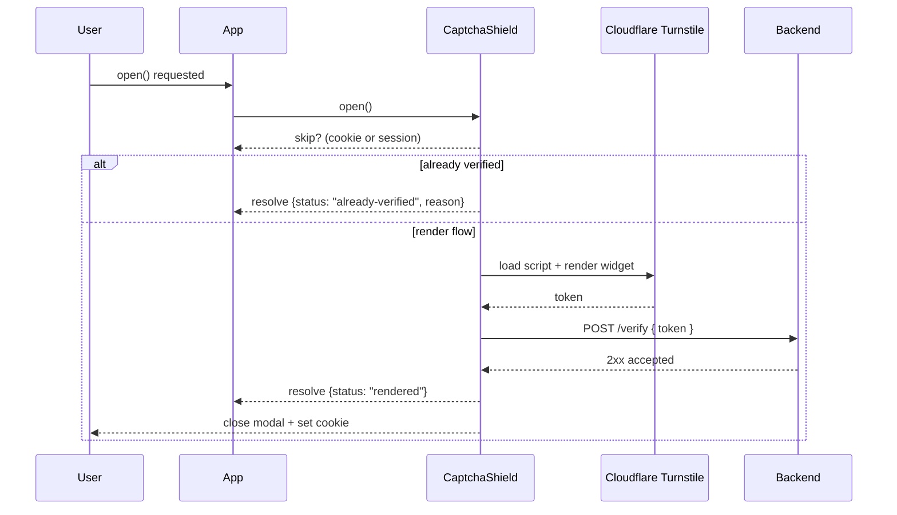
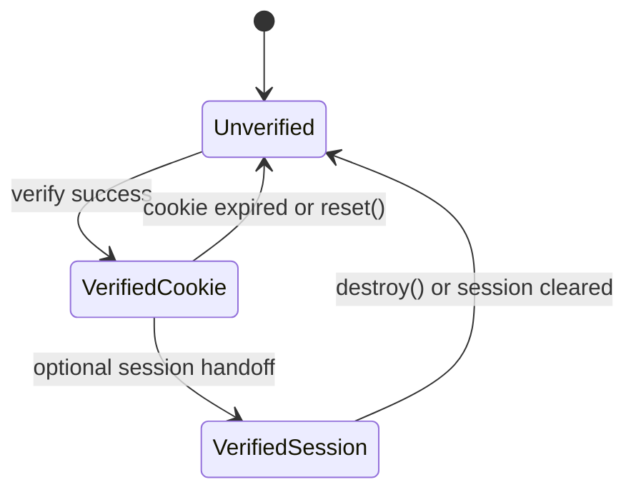

# CaptchaShield

[](https://www.npmjs.com/package/captchashield)
[](https://www.npmjs.com/package/captchashield)
[](https://bundlephobia.com/package/captchashield)
[](#api-surface)
[](LICENSE)

Cloudflare Turnstile modal for modern web apps. Drop-in UX, strict security defaults, and a cookie-based skip that keeps verified users out of the captcha tunnel.

## Contents
- [What is CaptchaShield?](#what-is-captchashield)
- [How it works](#how-it-works-mermaid)
- [Quick start](#quick-start)
- [Config cheat sheet](#config-cheat-sheet)
- [Recipes](#recipes)
- [Security and accessibility](#security-and-accessibility)
- [API surface](#api-surface)
- [Scripts](#scripts)
- [License](#license)

## What is CaptchaShield?
- Handles Turnstile loading, rendering, retries, and cleanup for you.
- Optional backend verification step with timeouts and retries.
- Skip logic via cookie or session so returning users breeze through.
- Bring your own modal/markup or use the minimal default styles.
- Integrity checks detect tampering (missing globals, removed widget, script SRI).

## How it works (Mermaid)

**Verification Path**



**Skip Cookie Lifecycle**



## Quick start

```bash
npm install captchashield
```

```ts
import { createCaptchaShield } from 'captchashield';

const shield = createCaptchaShield({
  siteKey: '<your-turnstile-sitekey>',
  onVerified: (token) => {
    // Send token to your backend for verification
  },
});

shield.open();
```

`open()` resolves immediately when a valid cookie or session exists; otherwise the modal renders, verifies, then saves the skip cookie.

## Config cheat sheet

- `siteKey` (required): Turnstile site key.
- `action` / `cData`: Optional Turnstile parameters.
- `turnstileScriptUrl`: Override the loader URL. Prefer the official CDN.
- `cookie`: `{ name, maxAgeSeconds, path, domain, sameSite, secure, useScopePrefix, scopeId }` controls skip-cookie scope and lifetime. Defaults: `secure: true`, `sameSite: "Lax"`.
- `modal`: copy (`title`, `body`, `helperText`), classes, `ariaLabel`, `closeOnVerify`, `injectDefaultStyle`, `styles.customCss`.
- `verify`: `{ endpoint, method, headers, timeoutMs, retries, buildBody, expectedStatus }` for server verification.
- `statusCheck`: optional `{ endpoint, timeoutMs, expectedStatus }` preflight before rendering.
- `integrity`: `{ scriptIntegrity, verifyTurnstileGlobal, enforceChallengePresence, monitorChallengeRemoval }`.
- `render`: fully custom renderer hook.
- Hooks: `onVerified(token)`, `onError(error)`.

### Security best practices

1) Server verification: Always hit Cloudflare `siteverify` on your backend; the cookie is UX only.  
2) HTTPS everywhere: Defaults set `Secure` cookies; keep it that way outside localhost.  
3) CSP: Allow `script-src` and `frame-src` `https://challenges.cloudflare.com`.  
4) POST tokens: Keep tokens out of URLs by using POST (default) for `verify`.  
5) CSS injection: Never pass user-generated CSS into `modal.styles.customCss`.  

## Recipes

### Custom renderer

```ts
const shield = createCaptchaShield({
  siteKey: '<sitekey>',
  render: ({ challengeContainer, close }) => {
    const overlay = document.createElement('div');
    overlay.className = 'my-overlay';
    const dialog = document.createElement('div');
    dialog.className = 'my-dialog';
    dialog.append('Prove you are human');
    dialog.append(challengeContainer); // Turnstile mounts here

    const closeBtn = document.createElement('button');
    closeBtn.textContent = 'Close';
    closeBtn.onclick = () => close();
    dialog.append(closeBtn);

    overlay.append(dialog);
    return { root: overlay };
  },
});

shield.open();
```

You control the DOM; CaptchaShield mounts Turnstile, manages lifecycle, retries, cookies, and teardown.

### Auto-verify to backend

```ts
const shield = createCaptchaShield({
  siteKey: '<sitekey>',
  verify: {
    endpoint: '/api/turnstile/verify', // POST, body {token} by default
    timeoutMs: 5000,
    retries: 1,
  },
  onError: (err) => console.error('Verification failed', err),
});

await shield.open();
```

The modal closes and sets the cookie only when the backend responds with the expected status (default: any 2xx). On failure, the widget resets and `onError` fires.

### Multi-site or subdomain usage

```ts
createCaptchaShield({
  siteKey: '<sitekey>',
  cookie: {
    name: 'captchashield',
    useScopePrefix: true, // adds host/scope to cookie name
    scopeId: 'dashboard', // optional explicit scope identifier
    domain: '.example.com', // share across subdomains if needed
  },
});
```

### Integrity and anti-tamper

- `integrity.scriptIntegrity`: sets SRI hash and `crossorigin="anonymous"` on the Turnstile script.
- `integrity.verifyTurnstileGlobal`: ensure `window.turnstile.render` exists.
- `integrity.enforceChallengePresence`: error if the challenge container disappears during mount.
- `integrity.monitorChallengeRemoval`: watches for removal of the challenge node and triggers `onError` plus cleanup.

### Configuration templates

**Strict security (production)**

```ts
const strictConfig: ShieldConfig = {
  siteKey: '0x4AAAAAA...',
  cookie: {
    secure: true,
    sameSite: 'Strict',
    path: '/',
    maxAgeSeconds: 3600,
  },
  integrity: {
    verifyTurnstileGlobal: true,
    enforceChallengePresence: true,
    monitorChallengeRemoval: true,
    // scriptIntegrity: 'sha384-...' // optional: pin Turnstile version
  },
  modal: {
    styles: { customCss: '' },
  },
  verify: {
    method: 'POST',
    endpoint: '/api/security/verify-captcha',
  },
};
```

**Development / localhost**

```ts
const devConfig: ShieldConfig = {
  siteKey: '1x00000000000000000000AA', // Cloudflare dummy sitekey always passes
  cookie: {
    secure: false,
    sameSite: 'Lax',
    name: 'dev_captcha_verified',
  },
  verify: {
    endpoint: undefined,
  },
};
```

### Minimal backend example (Express)

```ts
import type { Request, Response } from 'express';
import fetch from 'node-fetch';

const TURNSTILE_SECRET = process.env.TURNSTILE_SECRET!;

export async function verifyTurnstile(req: Request, res: Response) {
  const token = req.body?.token;
  if (!token) return res.status(400).json({ error: 'missing token' });

  const cfRes = await fetch('https://challenges.cloudflare.com/turnstile/v0/siteverify', {
    method: 'POST',
    headers: { 'content-type': 'application/json' },
    body: JSON.stringify({ secret: TURNSTILE_SECRET, response: token }),
  });

  const payload = await cfRes.json();
  if (payload.success) return res.sendStatus(204);
  return res.status(400).json({ success: false, error: payload['error-codes'] });
}
```

## Security and accessibility

- Errors are typed: all errors extend `CaptchaShieldError` with prefix `[CaptchaShield]`.
- Sanitized messages: no sensitive payloads (tokens, raw responses) leak into logs.
- Accessibility: set `ariaLabel` or custom markup; default modal includes focus trapping and escape close.
- CSP friendly: only external dependency is the Cloudflare Turnstile script and iframe.

## API surface

`createCaptchaShield(config)` returns:

- `open(): Promise<{ status: 'rendered' | 'already-verified'; reason?: 'cookie' | 'session' }>`
- `close()`: remove the modal without clearing state.
- `reset()`: clear token, cookie, and reset the Turnstile widget.
- `destroy()`: reset and close.
- `isVerified()`: whether the session or cookie is marked verified.
- `getToken()`: last Turnstile token (if any).

## Scripts

- `npm run dev` - tsup watch
- `npm run build` - bundle ESM/CJS plus types
- `npm run test` - Vitest (jsdom)
- `npm run lint` - ESLint (flat config)
- `npm run typecheck` - TypeScript strict, no emit

## License

MIT
