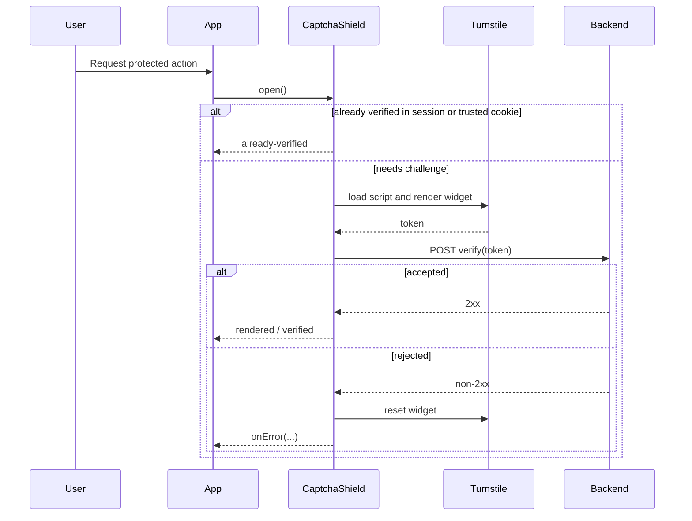
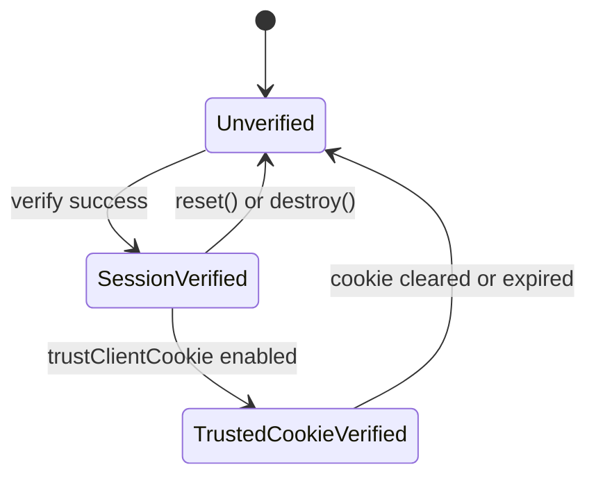
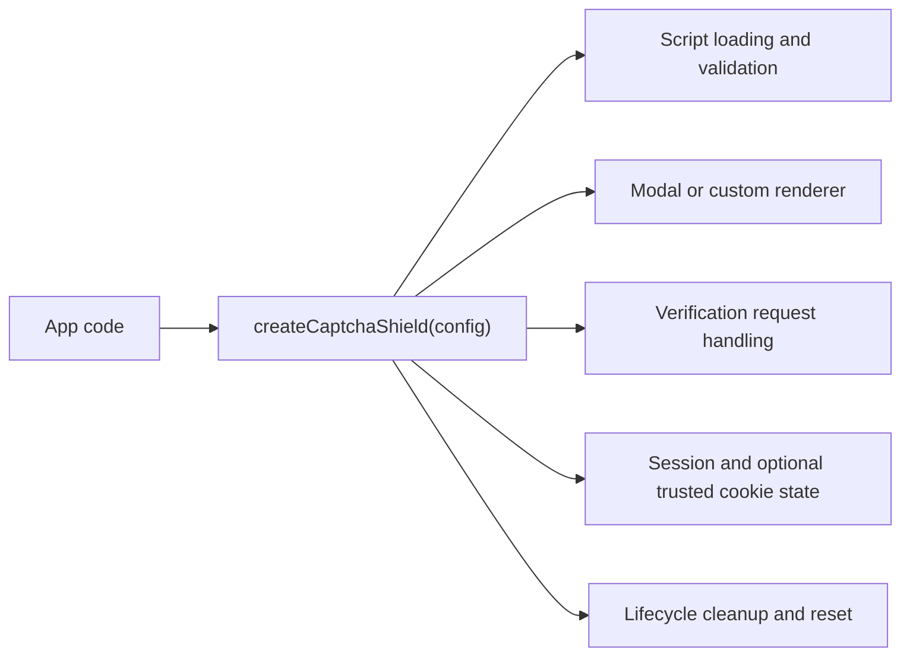
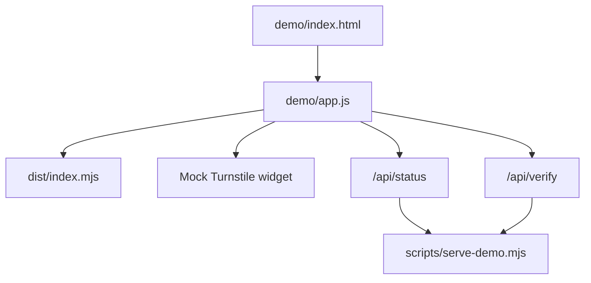

<div align="center">
  
  <h1>CaptchaShield</h1>
  <p>Cloudflare Turnstile modal for browser apps — script loading, token verification, session state, and cleanup included.</p>
</div>

[](https://www.npmjs.com/package/@maggidev/captchashield)
[](https://www.npmjs.com/package/@maggidev/captchashield)
[](https://bundlephobia.com/package/@maggidev/captchashield)
[](https://github.com/N0tMaggi/CapchaShield/actions/workflows/ci.yml)
[](#api-at-a-glance)
[](LICENSE)

---

## Install

```bash
npm install @maggidev/captchashield
```

## Quick Start

```ts
import { createCaptchaShield } from '@maggidev/captchashield';

const shield = createCaptchaShield({
  siteKey: '<your-turnstile-sitekey>',
  verify: {
    endpoint: '/api/turnstile/verify',
  },
  onVerified: (token) => {
    // proceed with the protected action
  },
  onError: (error) => {
    console.error(error.message);
  },
});

await shield.open();
```

**What your endpoint receives:** `POST` with `Content-Type: application/json` and body `{ "token": "..." }`. Any `2xx` response is treated as success; anything else triggers `onError`.

Verified state is session-local by default. Persistent skip via cookie only activates when `cookie.trustClientCookie` is enabled.

---

## Local Testing

**No Cloudflare account required.**

**Option A — built-in demo with mock widget:**

```bash
npm run demo
```

Opens at [http://127.0.0.1:4173/demo/](http://127.0.0.1:4173/demo/). The demo ships a mock Turnstile that fires the token callback immediately — no sitekey needed.

**Option B — Cloudflare public test keys** (real Turnstile script, no account):

| Sitekey | Behavior |
|---|---|
| `1x00000000000000000000AA` | Always passes |
| `2x00000000000000000000AB` | Always blocks |
| `3x00000000000000000000FF` | Always shows interactive challenge |

---

## Security Model

CaptchaShield improves Turnstile UX. It is not a substitute for backend enforcement.

- Always verify Turnstile tokens on your server for protected actions.
- Treat client cookies as UX convenience only. Do not use them as authorization.
- Only enable `cookie.trustClientCookie` when client-side skip is acceptable for your use case.
- Verification only supports `POST` — tokens never end up in URLs.
- Endpoint configuration is validated; custom script loading is restricted to the official Cloudflare host.
- `cookie.name`, `cookie.domain`, and `cookie.path` are validated against RFC 6265 at construction time — passing values with semicolons or control characters throws immediately.
- Custom CSS is injected as-is. Never pass user-generated content into `modal.styles.customCss`.

---

## Common Config

```ts
const shield = createCaptchaShield({
  siteKey: '0x4AAAAAA...',
  cookie: {
    secure: true,
    sameSite: 'Strict',
    trustClientCookie: false,
  },
  integrity: {
    verifyTurnstileGlobal: true,
    enforceChallengePresence: true,
    monitorChallengeRemoval: true,
  },
  verify: {
    endpoint: '/api/security/verify-captcha',
    timeoutMs: 5000,
    retries: 1,
  },
});
```

### Custom Renderer

```ts
createCaptchaShield({
  siteKey: '<sitekey>',
  render: ({ challengeContainer, close }) => {
    const root = document.createElement('div');
    const panel = document.createElement('section');
    const heading = document.createElement('h2');
    const closeButton = document.createElement('button');

    heading.textContent = 'Verification required';
    closeButton.textContent = 'Close';
    closeButton.onclick = close;

    panel.append(heading, challengeContainer, closeButton);
    root.append(panel);

    return { root };
  },
});
```

---

## Minimal Backend Example

```ts
import type { Request, Response } from 'express';
import fetch from 'node-fetch';

const TURNSTILE_SECRET = process.env.TURNSTILE_SECRET!;

export async function verifyTurnstile(req: Request, res: Response) {
  const token = req.body?.token;
  if (!token) return res.status(400).json({ error: 'missing token' });

  const cfRes = await fetch('https://challenges.cloudflare.com/turnstile/v0/siteverify', {
    method: 'POST',
    headers: { 'content-type': 'application/json' },
    body: JSON.stringify({ secret: TURNSTILE_SECRET, response: token }),
  });

  const payload = await cfRes.json();
  if (payload.success) return res.sendStatus(204);
  return res.status(400).json({ success: false, error: payload['error-codes'] });
}
```

---

## API At A Glance

`createCaptchaShield(config)` returns:

| Method | Description |
|---|---|
| `open()` | Show the modal. Returns `{ status: 'rendered' \| 'already-verified'; reason?: 'cookie' \| 'session' }` |
| `close()` | Remove the modal without clearing state |
| `reset()` | Clear token, trusted cookie, and reset the widget |
| `destroy()` | Reset and close |
| `isVerified()` | Inspect current verified state |
| `getToken()` | Read the last token seen by the instance |

Main config areas:

| Area | Controls |
|---|---|
| `modal` | Copy, classes, default style injection, custom CSS |
| `cookie` | Name, scope, lifetime, SameSite, secure flag, `trustClientCookie` |
| `verify` | Backend endpoint, timeout, retries, headers, expected status |
| `statusCheck` | Optional preflight request before render |
| `integrity` | Global checks, challenge presence enforcement, removal monitoring |
| `render` | Custom renderer hook |

---

## How It Works

### Verification Flow


```mermaid
sequenceDiagram
    participant User
    participant App
    participant CaptchaShield
    participant Turnstile
    participant Backend

    User->>App: Request protected action
    App->>CaptchaShield: open()
    alt already verified in session or trusted cookie
        CaptchaShield-->>App: already-verified
    else needs challenge
        CaptchaShield->>Turnstile: load script and render widget
        Turnstile-->>CaptchaShield: token
        CaptchaShield->>Backend: POST verify(token)
        alt accepted
            Backend-->>CaptchaShield: 2xx
            CaptchaShield-->>App: rendered / verified
        else rejected
            Backend-->>CaptchaShield: non-2xx
            CaptchaShield->>Turnstile: reset widget
            CaptchaShield-->>App: onError(...)
        end
    end
```

### Verified State


```mermaid
stateDiagram-v2
    [*] --> Unverified
    Unverified --> SessionVerified: verify success
    SessionVerified --> Unverified: reset() or destroy()
    SessionVerified --> TrustedCookieVerified: trustClientCookie enabled
    TrustedCookieVerified --> Unverified: cookie cleared or expired
```

### Package Responsibilities


```mermaid
flowchart LR
    A["App code"] --> B["createCaptchaShield(config)"]
    B --> C["Script loading and validation"]
    B --> D["Modal or custom renderer"]
    B --> E["Verification request handling"]
    B --> F["Session and optional trusted cookie state"]
    B --> G["Lifecycle cleanup and reset"]
```

---

## What The Package Handles

- Turnstile script loading from the official Cloudflare host
- Built-in modal rendering with sane defaults
- Custom render hook support
- Token verification requests with timeout and retry handling
- Widget reset and cleanup after reject or error
- Optional status precheck before rendering
- Challenge presence and removal monitoring
- Typed error callbacks

## What Your Backend Still Must Handle

- Final authorization decisions
- Turnstile secret management
- Token verification against Cloudflare `siteverify`
- Route protection and abuse policy
- Rate limiting, IP policy, and application-specific trust decisions

---

## Demo Lab

> The visuals below are from the local demo page in [`demo/`](demo). They show one testing surface only and do not represent every possible integration style or a recommended production design.

<p align="center">
  
</p>

<p align="center">
  
</p>

<p align="center">
  
  
</p>

The demo page includes:

- Default modal and custom renderer flows
- Local mock Turnstile behavior
- Local verify and status endpoints
- Session-only versus trusted-cookie behavior
- Tamper simulation
- Live config preview and event log

### Demo internals


```mermaid
flowchart TB
    UI["demo/index.html"] --> APP["demo/app.js"]
    APP --> LIB["dist/index.mjs"]
    APP --> MOCK["Mock Turnstile widget"]
    APP --> STATUS["/api/status"]
    APP --> VERIFY["/api/verify"]
    STATUS --> SERVER["scripts/serve-demo.mjs"]
    VERIFY --> SERVER
```

---

## Technologies

- TypeScript for the package surface and internal logic
- Cloudflare Turnstile as the challenge provider
- `tsup` for package bundling
- `vitest` with `jsdom` for unit and behavior tests
- `eslint` for static linting
- A small Node HTTP server for the local demo lab

## Scripts

| Command | Description |
|---|---|
| `npm run build` | Build ESM, CJS, and type declarations |
| `npm run dev` | tsup watch mode |
| `npm test` | Vitest |
| `npm run lint` | ESLint |
| `npm run typecheck` | TypeScript no-emit check |
| `npm run demo` | Build and start the local demo page |
| `npm run demo:serve` | Start the demo server without rebuilding |

---

## Roadmap

- Signed skip tokens backed by the server instead of plain trusted cookies
- First-party renderer presets for inline, sheet, and compact verification UIs
- Better analytics hooks for render, verify success, reject, timeout, and tamper events
- Framework adapters for Next.js, Express, edge runtimes, and Laravel
- A small end-to-end browser test suite for demo and package regression checks

---

## License

MIT
