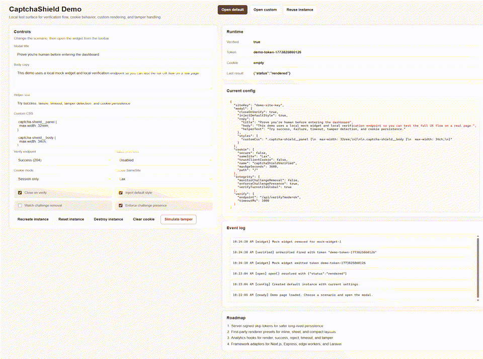
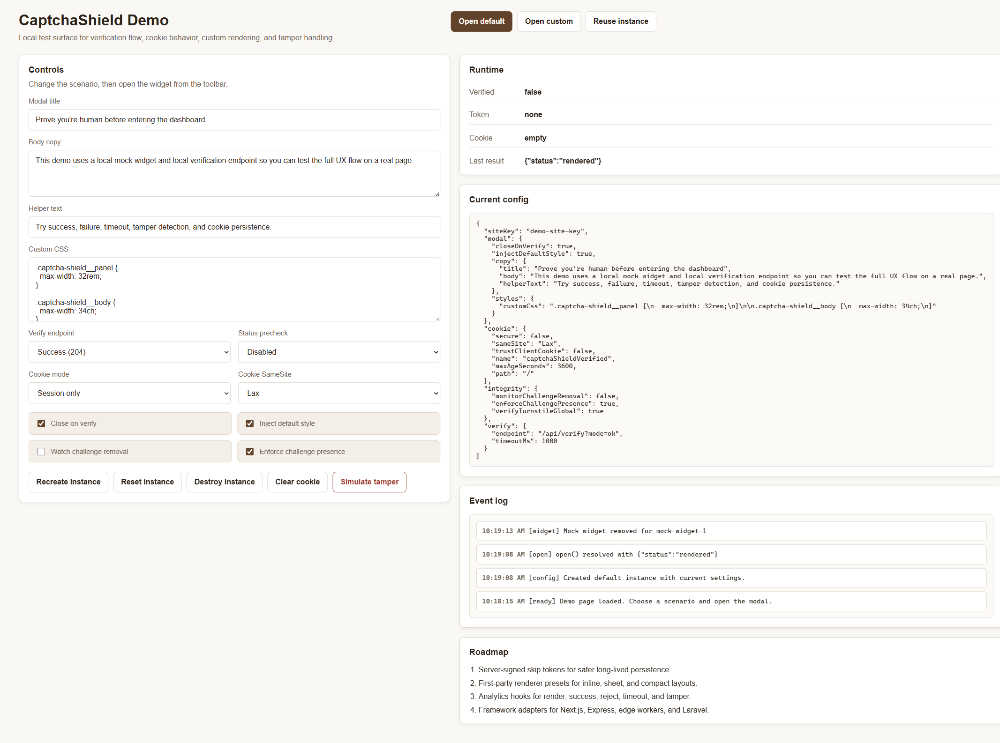
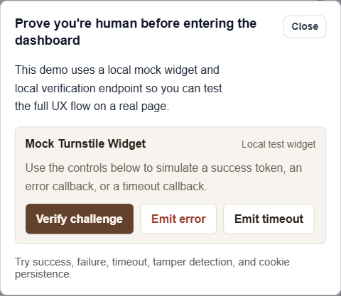
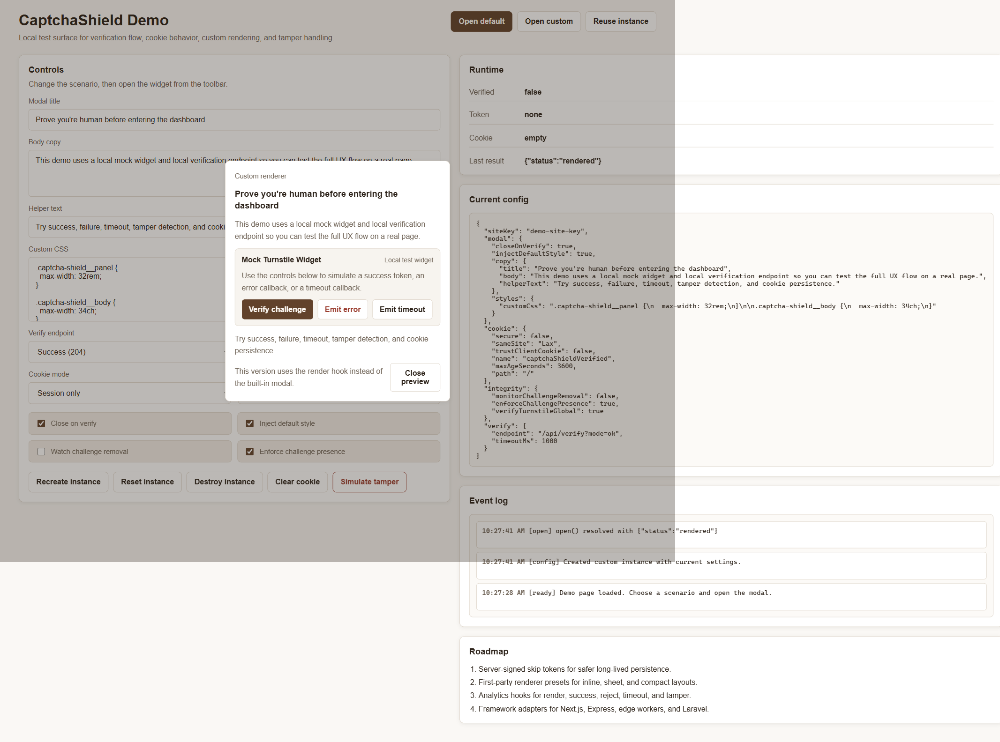
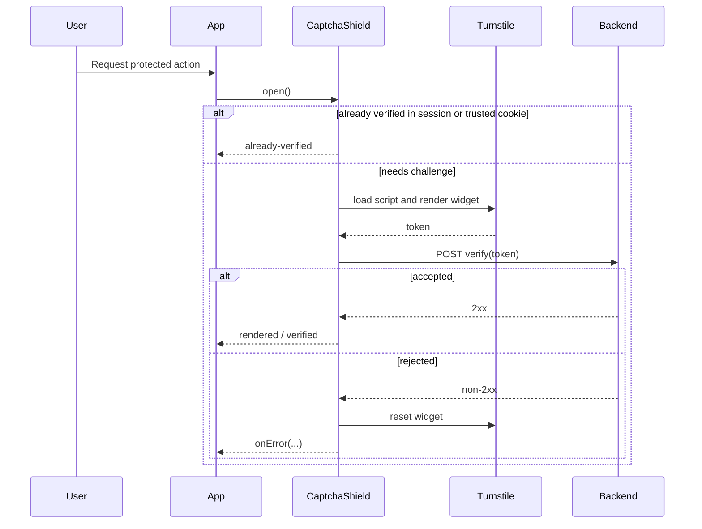
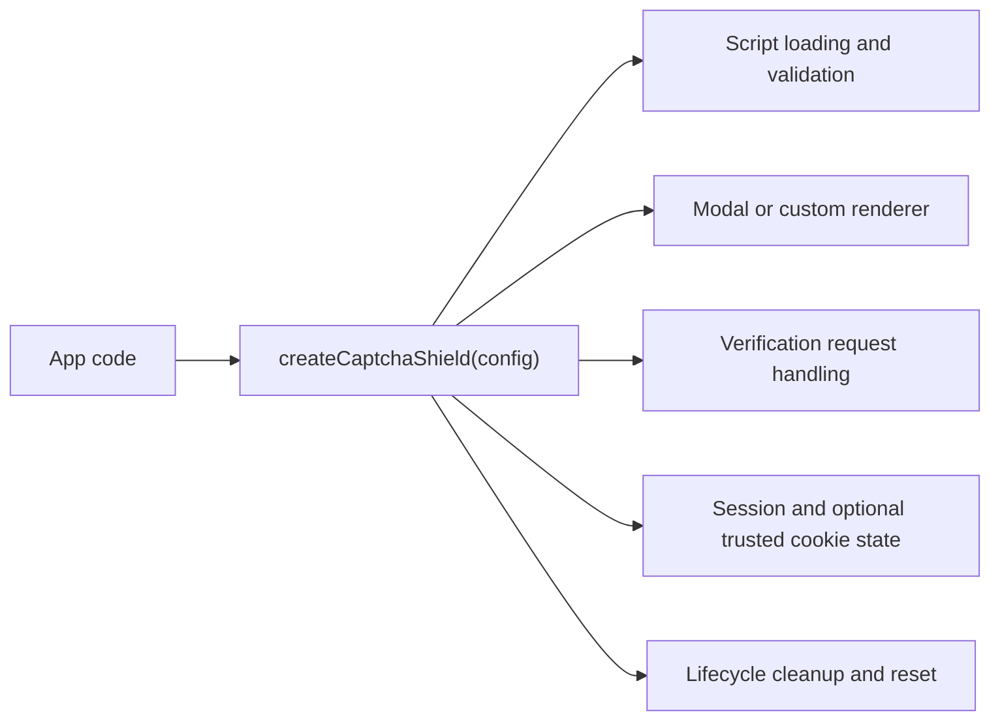
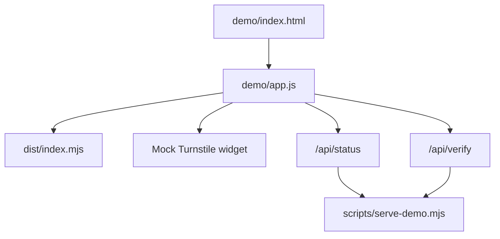
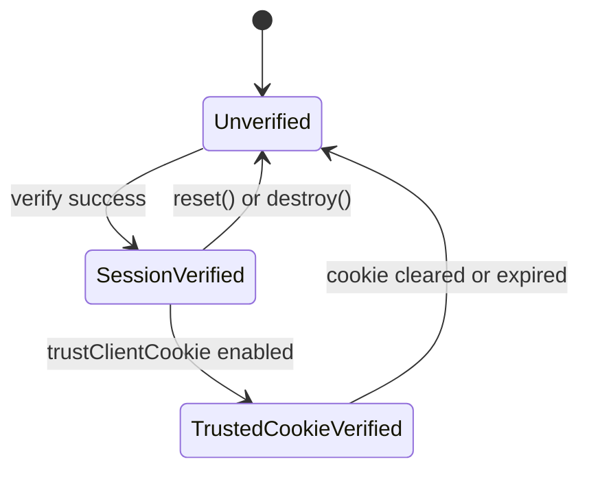

<div align="center">
  
  <h1>CaptchaShield</h1>
  <p>Cloudflare Turnstile modal for browser applications with secure defaults, optional backend verification, and a dedicated local demo lab.</p>
</div>

[](https://www.npmjs.com/package/@maggidev/captchashield)
[](https://www.npmjs.com/package/@maggidev/captchashield)
[](https://bundlephobia.com/package/captchashield)
[](https://github.com/N0tMaggi/CapchaShield/actions/workflows/ci.yml)
[](#api-at-a-glance)
[](LICENSE)

## Why

CaptchaShield exists for teams that want a straightforward Turnstile integration without rebuilding the same modal, cleanup, retry, and verification flow for every project.

- It keeps the browser-side integration small and focused.
- It supports both the built-in modal and custom renderers.
- It treats client persistence as explicit opt-in instead of a hidden default.
- It makes local testing easier with a dedicated demo page and mock widget.
- It is designed to stay honest about what is UX and what must still be enforced on the backend.

## Technologies

- TypeScript for the package surface and internal logic
- Cloudflare Turnstile as the challenge provider
- `tsup` for package bundling
- `vitest` with `jsdom` for unit and behavior tests
- `eslint` for static linting
- a small Node HTTP server for the local demo lab

## Demo

> The visuals below are from the local demo page in [`demo/`](demo). They show one testing surface only.
> They do not represent every possible integration style, every renderer, or a recommended production design for all consumers of the package.

<p align="center">
  
</p>

<p align="center">
  
</p>

<p align="center">
  
  
</p>

Run the local demo:

```bash
npm run demo
```

Then open:

[http://127.0.0.1:4173/demo/](http://127.0.0.1:4173/demo/)

The demo page includes:

- default modal and custom renderer flows
- local mock Turnstile behavior
- local verify and status endpoints
- session-only versus trusted-cookie behavior
- tamper simulation
- live config preview and event log

## How It Works

### Verification Flow


```mermaid
sequenceDiagram
    participant User
    participant App
    participant CaptchaShield
    participant Turnstile
    participant Backend

    User->>App: Request protected action
    App->>CaptchaShield: open()
    alt already verified in session or trusted cookie
        CaptchaShield-->>App: already-verified
    else needs challenge
        CaptchaShield->>Turnstile: load script and render widget
        Turnstile-->>CaptchaShield: token
        CaptchaShield->>Backend: POST verify(token)
        alt accepted
            Backend-->>CaptchaShield: 2xx
            CaptchaShield-->>App: rendered / verified
        else rejected
            Backend-->>CaptchaShield: non-2xx
            CaptchaShield->>Turnstile: reset widget
            CaptchaShield-->>App: onError(...)
        end
    end
```

### Package Responsibilities


```mermaid
flowchart LR
    A["App code"] --> B["createCaptchaShield(config)"]
    B --> C["Script loading and validation"]
    B --> D["Modal or custom renderer"]
    B --> E["Verification request handling"]
    B --> F["Session and optional trusted cookie state"]
    B --> G["Lifecycle cleanup and reset"]
```

### Demo Lab Surface


```mermaid
flowchart TB
    UI["demo/index.html"] --> APP["demo/app.js"]
    APP --> LIB["dist/index.mjs"]
    APP --> MOCK["Mock Turnstile widget"]
    APP --> STATUS["/api/status"]
    APP --> VERIFY["/api/verify"]
    STATUS --> SERVER["scripts/serve-demo.mjs"]
    VERIFY --> SERVER
```

### Verified State


```mermaid
stateDiagram-v2
    [*] --> Unverified
    Unverified --> SessionVerified: verify success
    SessionVerified --> Unverified: reset() or destroy()
    SessionVerified --> TrustedCookieVerified: trustClientCookie enabled
    TrustedCookieVerified --> Unverified: cookie cleared or expired
```

## What The Package Handles

- Turnstile script loading from the official Cloudflare host
- built-in modal rendering with sane defaults
- custom render hook support
- token verification requests with timeout and retry handling
- widget reset and cleanup after reject or error
- optional status precheck before rendering
- challenge presence and removal monitoring
- typed error callbacks

## What Your Backend Still Must Handle

- final authorization decisions
- Turnstile secret management
- token verification against Cloudflare `siteverify`
- route protection and abuse policy
- rate limiting, IP policy, and application-specific trust decisions

## Install

```bash
npm install captchashield
```

## Quick Start

```ts
import { createCaptchaShield } from 'captchashield';

const shield = createCaptchaShield({
  siteKey: '<your-turnstile-sitekey>',
  verify: {
    endpoint: '/api/turnstile/verify',
  },
  onVerified: (token) => {
    console.log('Verified token', token);
  },
  onError: (error) => {
    console.error(error.message);
  },
});

await shield.open();
```

By default, verified state is session-local. Persistent skip via cookie only happens when `cookie.trustClientCookie` is enabled.

## Security Model

CaptchaShield improves Turnstile UX. It is not a substitute for backend enforcement.

- Always verify Turnstile tokens on your server for protected actions.
- Treat client cookies as UX only. Do not use them as authorization.
- Only enable `cookie.trustClientCookie` when client-side skip is acceptable for your use case.
- Verification only supports `POST`, so tokens do not end up in URLs.
- Endpoint configuration is validated and custom script loading is restricted to the official Cloudflare host.
- `cookie.name`, `cookie.domain`, and `cookie.path` are validated against RFC 6265 at construction time — passing values with semicolons or control characters throws immediately.
- Custom CSS is injected as-is; never pass user-generated CSS into `modal.styles.customCss`.

## Common Config

```ts
const shield = createCaptchaShield({
  siteKey: '0x4AAAAAA...',
  cookie: {
    secure: true,
    sameSite: 'Strict',
    trustClientCookie: false,
  },
  integrity: {
    verifyTurnstileGlobal: true,
    enforceChallengePresence: true,
    monitorChallengeRemoval: true,
  },
  verify: {
    endpoint: '/api/security/verify-captcha',
    timeoutMs: 5000,
    retries: 1,
  },
});
```

### Custom Renderer

```ts
createCaptchaShield({
  siteKey: '<sitekey>',
  render: ({ challengeContainer, close }) => {
    const root = document.createElement('div');
    const panel = document.createElement('section');
    const heading = document.createElement('h2');
    const closeButton = document.createElement('button');

    heading.textContent = 'Verification required';
    closeButton.textContent = 'Close';
    closeButton.onclick = close;

    panel.append(heading, challengeContainer, closeButton);
    root.append(panel);

    return { root };
  },
});
```

## Minimal Backend Example

```ts
import type { Request, Response } from 'express';
import fetch from 'node-fetch';

const TURNSTILE_SECRET = process.env.TURNSTILE_SECRET!;

export async function verifyTurnstile(req: Request, res: Response) {
  const token = req.body?.token;
  if (!token) return res.status(400).json({ error: 'missing token' });

  const cfRes = await fetch('https://challenges.cloudflare.com/turnstile/v0/siteverify', {
    method: 'POST',
    headers: { 'content-type': 'application/json' },
    body: JSON.stringify({ secret: TURNSTILE_SECRET, response: token }),
  });

  const payload = await cfRes.json();
  if (payload.success) return res.sendStatus(204);
  return res.status(400).json({ success: false, error: payload['error-codes'] });
}
```

## API At A Glance

`createCaptchaShield(config)` returns:

- `open(): Promise<{ status: 'rendered' | 'already-verified'; reason?: 'cookie' | 'session' }>`
- `close()`: remove the modal without clearing state
- `reset()`: clear token, trusted cookie, and reset the widget
- `destroy()`: reset and close
- `isVerified()`: inspect current verified state
- `getToken()`: read the last token seen by the instance

Main config areas:

- `modal`: copy, classes, default style injection, custom CSS
- `cookie`: name, scope, lifetime, SameSite, secure flag, `trustClientCookie`
- `verify`: backend endpoint, timeout, retries, headers, expected status
- `statusCheck`: optional preflight request before render
- `integrity`: global checks, challenge presence enforcement, removal monitoring
- `render`: custom renderer hook

## Scripts

- `npm run dev` - tsup watch
- `npm run build` - build ESM, CJS, and type declarations
- `npm run test` - Vitest
- `npm run lint` - ESLint
- `npm run typecheck` - TypeScript no-emit check
- `npm run demo` - build and start the local demo page
- `npm run demo:serve` - start the demo server without rebuilding

## Roadmap

- Signed skip tokens backed by the server instead of plain trusted cookies
- First-party renderer presets for inline, sheet, and compact verification UIs
- Better analytics hooks for render, verify success, reject, timeout, and tamper events
- Framework adapters for Next.js, Express, edge runtimes, and Laravel
- A small end-to-end browser test suite for demo and package regression checks

## License

MIT
